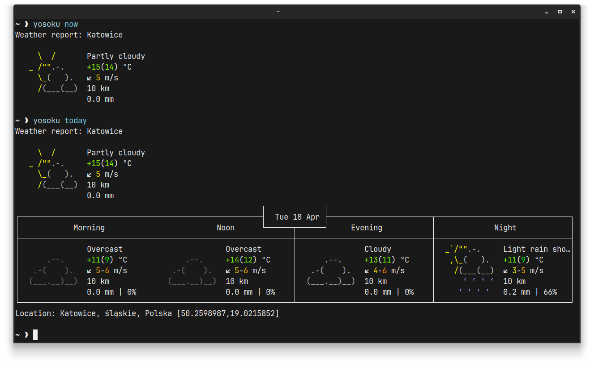

<h1 align="center">
    <br>
    Yosoku
</h1>

<p align="center"><b>Minimalist</b> and <b>cross-platform</b> weather application for your terminal.</p>



## Features

- Get forecast information **in your terminal**.
- Works **fast** as possible.
- Uses [wttr.in](https://wttr.in/) API for fast requests and responses.
- **Lightweight** and **minimalist**.
- Works without separate programs.
- Works in **Windows**, **Linux** and **macOS**.

## Quick Start

1. Go to releases page and download archive that match your system and architecture.
> **Warning**: At this moment app compiled only for Linux, but you can clone repository and compile for your platform. We will add compiled versions for other platforms soon.
2. Move content of archive to directory that available in `PATH` variable.
> **Note**: To check which directories included in `PATH` use `echo $PATH` command. On some systems paths can be devided by colomns.
3. Now you can call Yosoku from your terminal (it will give you a help message if you give no arguments). Creation of configuration file are optional.

## Configuration

Yosoku reads configuration from configuration directory in your home directory.

- **Windows** - `C:\Users\<USERNAME>\.config\yosoku.toml`
- **Linux** - `/home/<USERNAME>/.config/yosoku.toml`
- **macOS** - `/Users/<USERNAME>/.config/yosoku.toml`

> **Note**: Configuration file are optional and program can use default values. If you want to change something you need to create configuration file and change what you want.

Configuration file have a TOML structure and can be easily modified.

```toml
location = ""
units = "metric"
forecast_view = "detailed"
language = "en"
```

| Option          | Description                                                           | Value Type                                                           |
| :-------------- | :-------------------------------------------------------------------- | :------------------------------------------------------------------- |
| `location`      | Name of city, coordinates or location where you want to get forecast. | Any `string`                                                         |
| `units`         | Which unit system will be used for temprature display.                | `metric` or `us`                                                     |
| `forecast_view` | How to display forecast.                                              | `detailed`, `minimalist` or `super_minimalist`                       |
| `language`      | Language that will be used for text.                                  | See `Supported languages` at [wttr.in/:help](https://wttr.in/:help). |

## Build from source

1. Download **Git** and **Rust toolchain**.
2. Clone repository via **Git**.
3. Change directory to cloned repository.
4. Use `cargo build` to compile **unoptimized debug program** . Add `--release` option to the end of line to compile **app with optimization**.

> **For Windows users**: If you incounter error while building application, try to compile it via **WSL**.

## Contribution

You can easily get involved in Yosoku project. But, how?

- Suggest code fixes.
- Search for bugs and code vulnarabilites.
- Suggest new features.
- Or help us by spreading information about our project!

If you want to make code changes, do this steps:

1. Fork this repository.
2. Clone forked repository.
3. Make changes to code base.
4. Push changes to forked repository.
5. Make merge request on Yosoku repository and wait for response.

